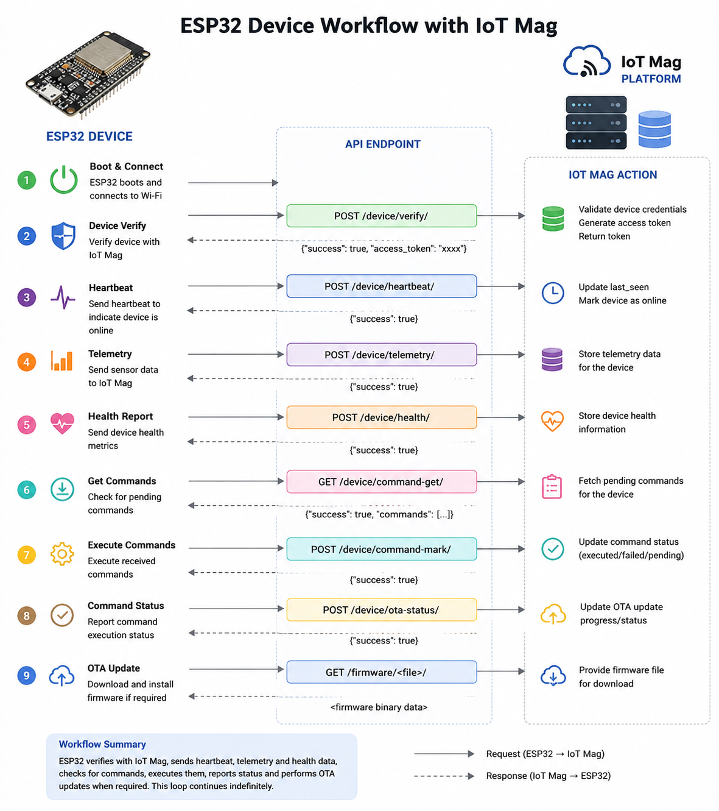
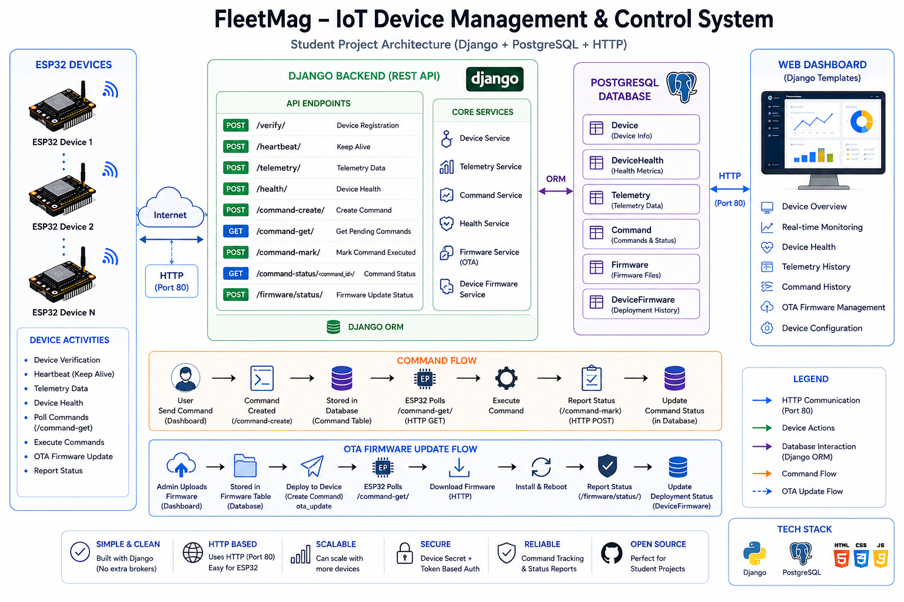
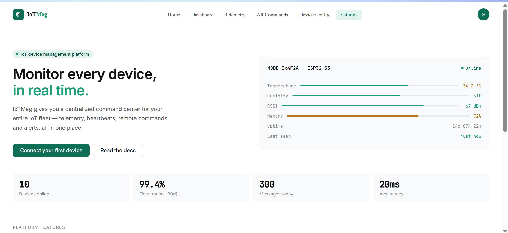
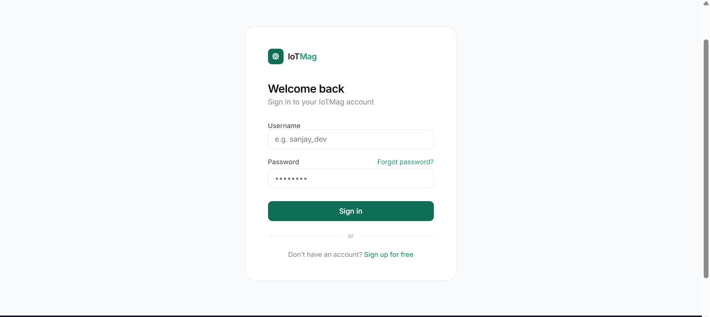
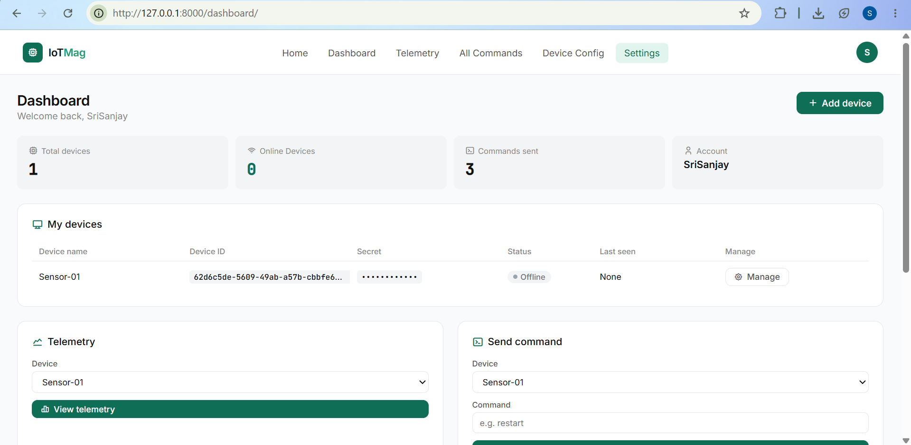
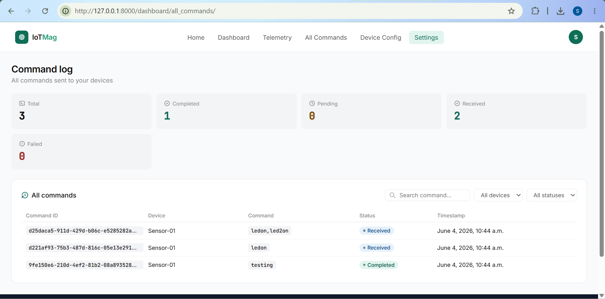
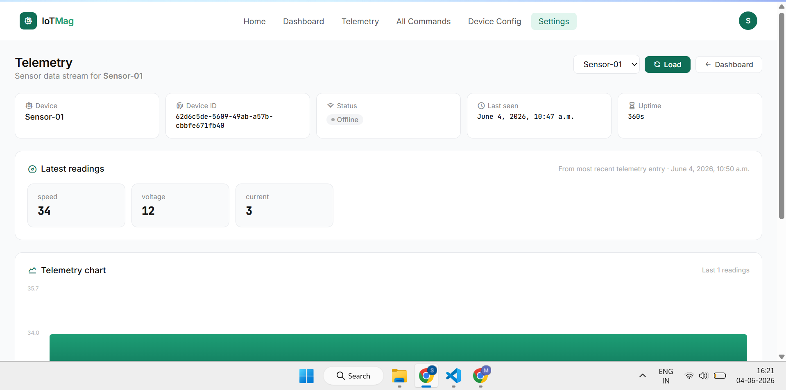
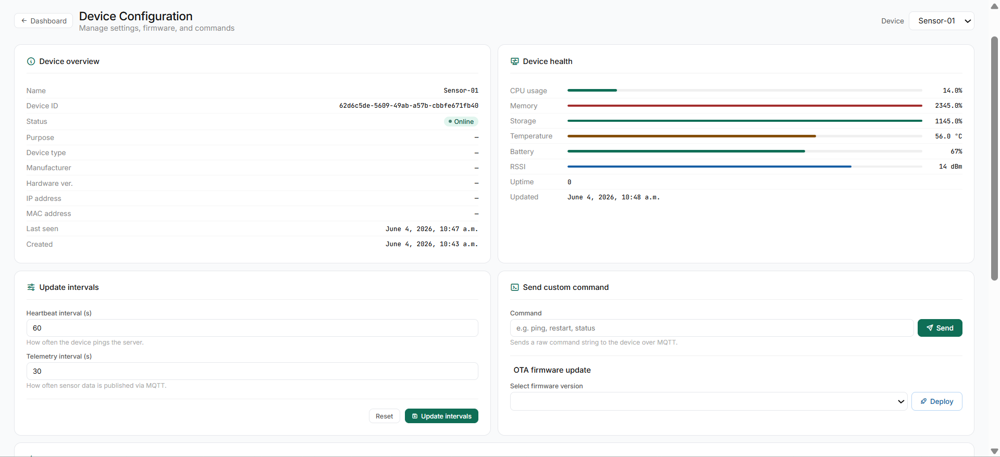
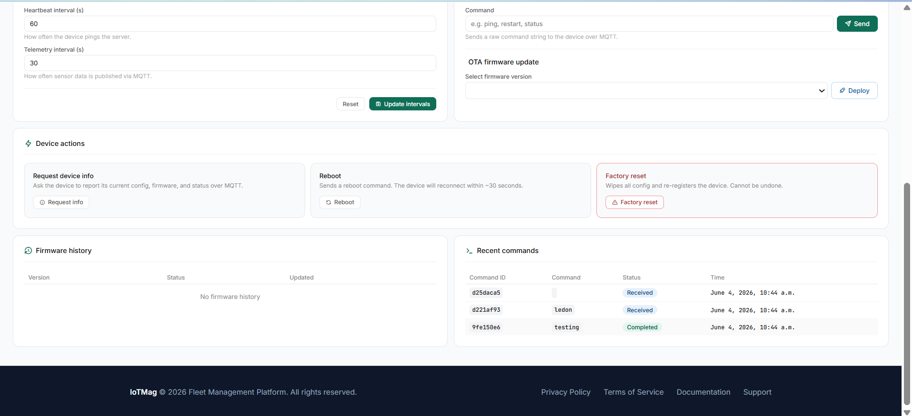

# IoT Mag - IoT Device Management and Control

A web-based platform for managing and monitoring IoT devices built with Django and PostgreSQL.

> 🎓 **Student Project** Built as a learning project to explore IoT device management, REST APIs, and real-time monitoring concepts.


## Live Demo

🔗 https://srisanjay.pythonanywhere.com/


## Note ⚠️

Do not share personal information while using this project. You may use dummy emails and test data.

This project is currently under development.

---

## About

IoT Mag is a backend focused platform that acts as a central hub for IoT devices. Devices communicate with the platform over HTTP, sending telemetry data, health reports, and firmware status updates. From the web dashboard, you can monitor all connected devices, issue commands, and push firmware updates all from one place.

This project was built to understand how real world IoT platforms work, covering device authentication, data ingestion, and remote device control.

---

## Application

The platform has two sides:

**Device Side (Embedded / Firmware)**
- Devices register and get verified on first boot
- They periodically send heartbeat, telemetry, and health data
- They poll for pending commands and report firmware update status

**Dashboard Side (Web)**
- View all registered devices and their current status
- Monitor live telemetry and health metrics
- Create and track commands sent to devices
- Manage and deploy OTA firmware updates

---

## Features

- **Device Management** — Register and verify devices easily
- **Telemetry Monitoring** — Track real time data from your devices
- **Health Monitoring** — Keep an eye on device status and performance
- **Command Management** — Send and track commands to devices
- **OTA Firmware Updates** — Deploy firmware to devices over the air

---

## Tech Stack

| Layer | Technology |
|---|---|
| Backend | Django, Django REST Framework |
| Database | PostgreSQL |
| Frontend | HTML, CSS, JavaScript |

---

## Run using docker


## API Workflow



## Usage

### 1. Register a Device

Send a POST request to `/verify/` with your device credentials. On success, you'll receive an **access token**  save this, as it's required for all future requests.

### 2. Authenticate Requests

Include the access token in the `Authorization` header for every API call:

```
"access_token": "fe8ce96357e8e8d6bd8c85cfd3f32f788a9fb4213fc5b883e5219dd78f7c802d"
```

### 3. Start Sending Data

Once authenticated, your device can start sending heartbeats, telemetry, and health reports to keep the dashboard updated.

### 4. Poll for Commands

Call `/command-get/` regularly to check if any commands have been issued from the dashboard. After executing a command, mark it done via `/command-mark/`.

---

## Access Token

Every device gets a unique **access token** after successful verification. This token identifies the device and secures all communication with the platform.

| Detail | Info |
|---|---|
| Obtained from | `POST /verify/` |
| Used in | All subsequent API requests |
| Header format | `Authorization: Bearer <token>` |
| Scope | Per device each device has its own token |

**Example verification request:**

```json
POST /verify/
Content-Type: application/json

{
     "device_id": "9fbe4309-5425-4b29-84bf-38a79b6a8350",
     "device_secret": "913c04f325a6102eae0098af4e208aba92efa2c09c3d995bec353adfb1d133e7"
}
```

**Example response:**

```json
{
  "success": true,
  "message": "Device verified successfully",
  "access_token": "fe8ce96357e8e8d6bd8c85cfd3f32f788a9fb4213fc5b883e5219dd78f7c802d"
}
```

> ⚠️ Keep your access token safe. Do not expose it in logs or public code.

---

## API Reference

### Device

| Method | Endpoint | Description |
|---|---|---|
| POST | `/verify/` | Verify a device |
| POST | `/heartbeat/` | Send a heartbeat signal |
| POST | `/telemetry/` | Submit telemetry data |
| POST | `/health/` | Report device health |

### Commands

| Method | Endpoint | Description |
|---|---|---|
| POST | `/command-create/` | Create a new command |
| GET | `/command-get/` | Fetch pending commands |
| POST | `/command-mark/` | Mark a command as done |
| GET | `/command-status/<command_id>/` | Check command status |

### Firmware

| Method | Endpoint | Description |
|---|---|---|
| POST | `/firmware/status/` | Report firmware update status |

---

## Database Models

- `Device`
- `DeviceHealth`
- `Telemetry`
- `Command`
- `Firmware`
- `DeviceFirmware`

---

## Architecture



---

## Screenshots

| Index | Login |
|---|---|
|  |  |

| Dashboard | All Commands |
|---|---|
|  |  |

| Telemetry | Device Configuration |
|---|---|
|  |  |



---

## Planned Improvements

- API Documentation - Half completed
- Postgres - DONE
- Custom error page - DONE
- Redis -DONE
- Login/Signup EMAIL 
- MQTT protocol support
- Device grouping
- Analytics dashboard


---

## Note

This is my first backend project , it contains some errors and ineffective code.
Please let me know your comments , i would like to impove myself

Thank you ❤️

---

## Author

**Sri Sanjay K**

[LinkedIn →](https://www.linkedin.com/in/srisanjayk/)

### Made with ❤️
